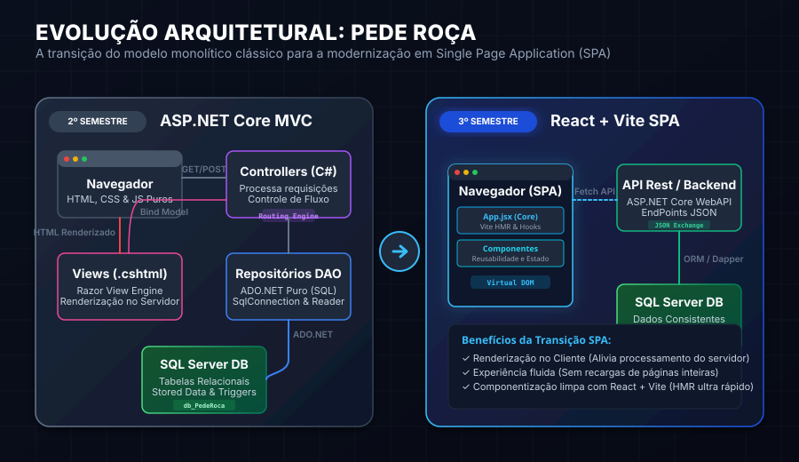
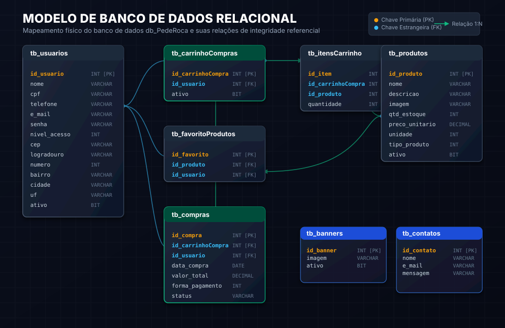
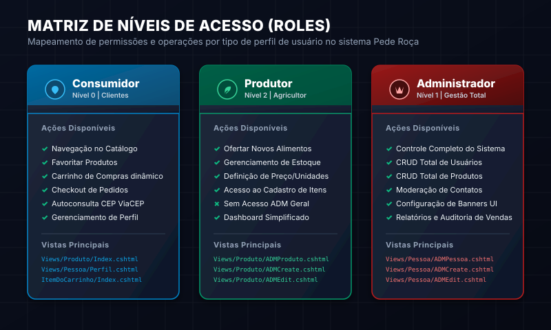

# 🥦 Pede Roça — E-Commerce de Agricultura Familiar

[](https://fatecmatao.com.br/)
[](https://github.com/HugoFrajacomo/PedeRoca)
[](https://dotnet.microsoft.com/en-us/apps/aspnet)
[](https://react.dev/)

O **Pede Roça** é uma plataforma digital interdisciplinar desenvolvida ao longo dos semestres na **Fatec Matão**. Trata-se de um marketplace bilateral voltado a conectar diretamente **produtores agrícolas familiares** e **consumidores urbanos**, promovendo o comércio justo, reduzindo intermediários e facilitando a distribuição de alimentos frescos, orgânicos e saudáveis na região.

---

## 🧭 Âncoras e Pontos de Interesse de Conhecimento

Para facilitar a sua navegação pelas competências aplicadas no repositório, utilize os links rápidos abaixo:

* [📈 Linha do Tempo e Evolução dos Projetos](#-linha-do-tempo-e-evolucao-dos-projetos)
  * [1º Semestre — Engenharia e Requisitos de Software](#1º-semestre--fundamentos-e-requisitos-de-software)
  * [2º Semestre — O Núcleo Transacional (C# + ASP.NET Core + SQL Server)](#2º-semestre--o-nucleo-transacional-caspnet-core-mvc-sql-server)
  * [3º Semestre — Modernização SPA (React + Vite)](#3º-semestre--modernizacao-e-transicao-arquitetural-react--vite)
* [🏗️ Engenharia de Software e Evolução Arquitetural](#-engenharia-de-software-e-evolucao-arquitetural)
* [💾 Modelo Relacional e Segurança de Banco de Dados](#-modelo-relacional-e-seguranca-de-banco-de-dados)
* [🔐 Controle de Acesso e Matriz de Permissões (Roles)](#-controle-de-acesso-e-matriz-de-permissoes-roles)
* [🛠️ Detalhes de Implementação e Código Destacado](#-detalhes-de-implementacao-e-codigo-destacado)
  * [Acesso a Dados com ADO.NET e Segurança SQL Injection](#acesso-a-dados-com-adonet-e-seguranca-contra-sql-injection)
  * [Recursos Frontend: Integração ViaCEP e Lógica de Carrinho](#recursos-frontend-integracao-viacep-e-logica-de-carrinho)
* [🚀 Guia de Instalação e Execução](#-guia-de-instalacao-e-execucao)
* [🎓 Matriz de Competências e Grade Aplicada](#-matriz-de-competencias-e-grade-aplicada)

---

## 📈 Linha do Tempo e Evolução dos Projetos

O desenvolvimento do **Pede Roça** reflete o amadurecimento acadêmico e técnico ao longo do curso, progredindo da concepção teórica para o desenvolvimento de backend robusto e, por fim, para o desacoplamento de interfaces web de alto desempenho.

### 1º Semestre — Fundamentos e Requisitos de Software
Foco na estruturação da ideia de negócio, engenharia de requisitos, análise de processos de logística agrícola e especificação funcional.
* **Entregáveis**: Modelagem conceitual, casos de uso, diagrama de fluxos de processos de negócios e wireframes navegáveis.
* **Acesse a Documentação**: [PDF do Projeto Finalizado do 1º Semestre](./1º%20Semestre/Documentação%201º%20Sementres/Projeto%20Finalizado.pdf).

### 2º Semestre — O Núcleo Transacional (C# + ASP.NET Core MVC + SQL Server)
Construção do sistema web completo utilizando o ecossistema .NET. Foi adotado o padrão arquitetural **MVC** tradicional acoplado a um banco de dados relacional.
* **Backend**: ASP.NET Core MVC (C#) e Arquitetura **DAO (Data Access Object)** implementada de forma pura com **ADO.NET** (SqlConnection, SqlCommand e SqlDataReader).
* **Banco de Dados**: Microsoft SQL Server com relacionamentos bem-definidos, chaves primárias/estrangeiras e integridade referencial.
* **Frontend**: Views dinâmicas em Razor (.cshtml) estilizadas com CSS sob medida, bootstrap e scripts nativos em JavaScript (ViaCEP, máscaras, cálculo de total).
* **Acesse o Código**: 
  * [Solução Visual Studio (SLN)](./2º%20Semestre/PedeRoca/PedeRoca.sln)
  * [Diretório do Código-Fonte C#](./2º%20Semestre/PedeRoca/PedeRoca/)
  * [Scripts SQL do Banco de Dados](./2º%20Semestre/BancoDeDados/)

### 3º Semestre — Modernização e Transição Arquitetural (React + Vite)
Início da modernização da interface do usuário do Pede Roça, convertendo o frontend de Server-Side Rendered (Razor MVC) para um modelo altamente desacoplado de **Single Page Application (SPA)** no lado do cliente.
* **Tecnologias**: React (v18) + Vite para compilação ultra rápida (ESM e HMR instantâneo).
* **Arquitetura**: Componentização modular baseada em estados para viabilizar um catálogo reativo e atualizações de carrinho de altíssima performance.
* **Acesse o Código**: [Projeto React SPA](./3ºSemestre/pedeRoca/)

---

## 🏗️ Engenharia de Software e Evolução Arquitetural

Abaixo está o diagrama explicativo que ilustra a evolução da arquitetura do **Pede Roça**: do modelo monolítico clássico em ASP.NET Core MVC no 2º Semestre para a arquitetura Single Page Application moderna com React no 3º Semestre.



---

## 💾 Modelo Relacional e Segurança de Banco de Dados

O banco de dados relacional `db_PedeRoca` foi estruturado no Microsoft SQL Server focado em alta normalização das tabelas transacionais (`tb_usuarios`, `tb_produtos`, `tb_carrinhoCompras`, `tb_itensCarrinho` e `tb_compras`).

Veja abaixo o mapeamento do modelo Entidade-Relacionamento (ER) do sistema:



### Diferenciais do Design de Banco de Dados:
* **Integridade Referencial**: Chaves Estrangeiras (`FK`) estritas acionadas para impedir órfãos de dados e garantir compras consistentes.
* **Desempenho**: Separação clara de cabeçalho de carrinho (`tb_carrinhoCompras`) e linhas do carrinho (`tb_itensCarrinho`) para consultas otimizadas e persistência temporária de sessões de compras.

---

## 🔐 Controle de Acesso e Matriz de Permissões (Roles)

O sistema possui um sistema de autenticação de múltiplos níveis de acesso (configurado no enum [NivelDeAcesso.cs](./2º%20Semestre/PedeRoca/PedeRoca/Models/Entities/Enuns/NivelDeAcesso.cs)). O diagrama a seguir ilustra a distribuição de privilégios de cada papel dentro do ecossistema do Pede Roça:



---

## 🛠️ Detalhes de Implementação e Código Destacado

### Acesso a Dados com ADO.NET e Segurança contra SQL Injection

Diferente de projetos acadêmicos comuns que usam ORMs prontos (como Entity Framework), o Pede Roça no 2º Semestre foi construído usando **ADO.NET Puro** (padrão DAO). Isso demonstra total domínio sobre instruções SQL escritas manualmente, otimização de consultas e gerenciamento manual do ciclo de conexões do banco de dados.

Um exemplo disso é o arquivo [ProdutoDAO.cs](./2º%20Semestre/PedeRoca/PedeRoca/Repositories/ADO/SQLServer/ProdutoDAO.cs). Todas as consultas utilizam a cláusula `using` para fechamento seguro de conexões (`SqlConnection`) e **parâmetros de comando (`SqlParameter`) para blindar o sistema contra ataques de SQL Injection**:

```csharp
// Exemplo conceitual do ProdutoDAO.cs utilizando consultas parametrizadas
using (SqlConnection connection = new SqlConnection(this.connectionString))
{
    connection.Open();
    using (SqlCommand command = new SqlCommand())
    {
        command.Connection = connection;
        command.CommandText = "SELECT id_produto, nome, preco_unitario FROM tb_produtos WHERE id_produto = @id AND ativo = 1";
        
        // Parâmetro blindado contra SQL Injection
        command.Parameters.AddWithValue("@id", id);

        using (SqlDataReader dr = command.ExecuteReader())
        {
            if (dr.Read())
            {
                // Mapeamento manual do objeto relacional
                Produto produto = new Produto();
                produto.Id_produtos = (int)dr["id_produto"];
                produto.Nome = (string)dr["nome"];
                produto.PrecoUnitario = (decimal)dr["preco_unitario"];
                return produto;
            }
        }
    }
}
```

### Recursos Frontend: Integração ViaCEP e Lógica de Carrinho

O frontend do 2º Semestre traz ótimas soluções em JS nativo focadas na experiência do usuário (UX):
1. **CEP Inteligente**: A integração com a API ViaCEP ([ViaCEP.js](./2º%20Semestre/PedeRoca/PedeRoca/wwwroot/js/ViaCEP.js)) preenche automaticamente o endereço completo do cliente durante a digitação do CEP na tela de [Cadastro](./2º%20Semestre/PedeRoca/PedeRoca/Views/Pessoa/Cadastro.cshtml).
2. **Cálculo de Preço Dinâmico**: O arquivo [_cardPrecoTotal.js](./2º%20Semestre/PedeRoca/PedeRoca/wwwroot/js/_cardPrecoTotal.js) calcula instantaneamente os valores do carrinho de compras sem necessidade de recarga da página no servidor, aliviando o tráfego da rede.

---

## 🚀 Guia de Instalação e Execução

### Pré-requisitos
* [.NET SDK 6.0 ou superior](https://dotnet.microsoft.com/download)
* [Node.js v18 ou superior](https://nodejs.org/)
* [Microsoft SQL Server LocalDB ou Express](https://www.microsoft.com/pt-br/sql-server/sql-server-downloads)

---

### Passo 1: Configuração do Banco de Dados SQL Server
1. Abra o gerenciador de banco de dados (ex: SQL Server Management Studio - SSMS).
2. Execute o script de criação de tabelas: [Criar_Banco.sql](./2º%20Semestre/BancoDeDados/Criar_Banco.sql).
3. Execute o script de inserção de dados iniciais: [Dados_Banco.sql](./2º%20Semestre/BancoDeDados/Dados_Banco.sql) para alimentar as tabelas com usuários de teste e produtos no catálogo.

---

### Passo 2: Executar o Projeto ASP.NET Core MVC (2º Semestre)
1. Navegue até a pasta do projeto .NET:
   ```bash
   cd "2º Semestre/PedeRoca/PedeRoca"
   ```
2. Abra o arquivo `appsettings.json` e verifique a sua string de conexão na propriedade `ConnectionStrings`. Ajuste o `Server` e as credenciais se necessário.
3. Restaure as dependências do NuGet e execute a aplicação:
   ```bash
   dotnet restore
   dotnet run
   ```
4. O servidor iniciará localmente. Acesse no navegador o endereço retornado no terminal (geralmente `https://localhost:7147` ou `http://localhost:5147`).

---

### Passo 3: Executar o Projeto React + Vite (3º Semestre)
1. Navegue até a pasta do projeto React:
   ```bash
   cd "3ºSemestre/pedeRoca"
   ```
2. Instale os pacotes e dependências de desenvolvimento do Node:
   ```bash
   npm install
   ```
3. Inicie o servidor de desenvolvimento reativo com Vite:
   ```bash
   npm run dev
   ```
4. Abra o navegador no endereço indicado (geralmente `http://localhost:5173`).

---

## 🎓 Matriz de Competências e Grade Aplicada

A tabela abaixo correlaciona as tecnologias aplicadas no projeto **Pede Roça** com as principais disciplinas da matriz curricular da **Fatec Matão**:

| Semestre | Disciplina Fatec Matão | Conceito / Tecnologia Aplicado no Pede Roça |
| :---: | :--- | :--- |
| **1º** | Engenharia de Software I / II | Levantamento de requisitos funcionais, Wireframes e Diagramas de Casos de Uso |
| **1º / 2º** | Banco de Dados I / II | Modelagem de dados conceitual e física, normalização de tabelas SQL e integridade referencial |
| **2º** | Programação Orientada a Objetos | Estruturação de Entidades C#, Enums fortemente tipados e separação de lógica de domínio |
| **2º** | Linguagem de Programação | Desenvolvimento backend robusto em C# com arquitetura de Controllers no ASP.NET |
| **2º** | Desenvolvimento Web I / II | Padrão MVC, Views com Razor Engine (.cshtml), CSS dinâmico e consumo de API ViaCEP em JavaScript |
| **2º** | Segurança de Sistemas | Prevenção a SQL Injection via parametrização manual de comandos no ADO.NET |
| **3º** | Desenvolvimento Web III | Single Page Application (SPA) reativa no lado do cliente utilizando React e empacotamento com Vite |

---

> Projeto desenvolvido por **Hugo Frajacomo** como material de portfólio acadêmico da **Fatec Matão**.  
> Sinta-se à vontade para explorar o código e entrar em contato em caso de dúvidas! 🥦🌽🚜
